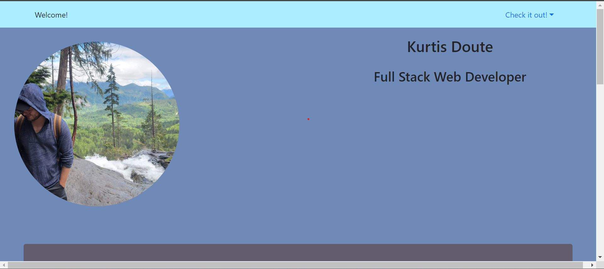
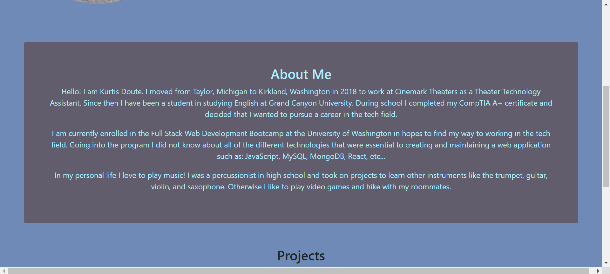
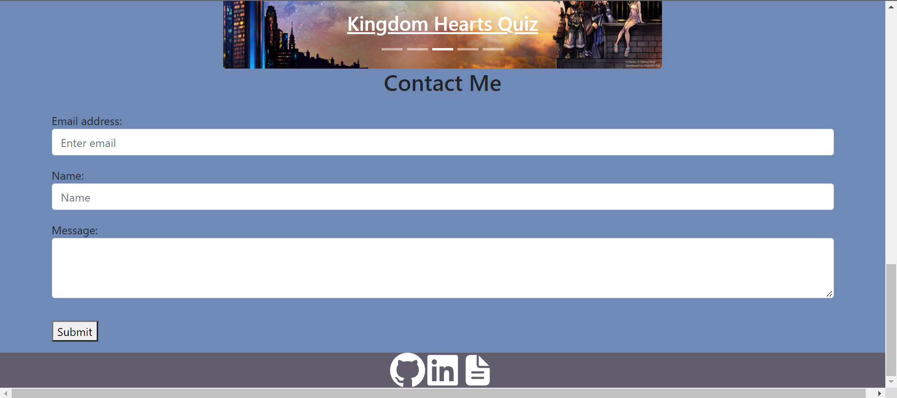

# Professional Portfolio

# Discription
A professional portfolio that will show all of my contact information and projects that I have been apart of.

# Table of Contents

-[Description](#description)
-[Installation](#installation)
-[Deployed](#deployed-link)
-[App Screenshot](#app-screenshot)
    

# Installation

Access application through the deployment link.  

# App Screenshot

Screenshot

# Deployed Link
[Deployed Page Link](kdouts.github.io/react-portfolio)
